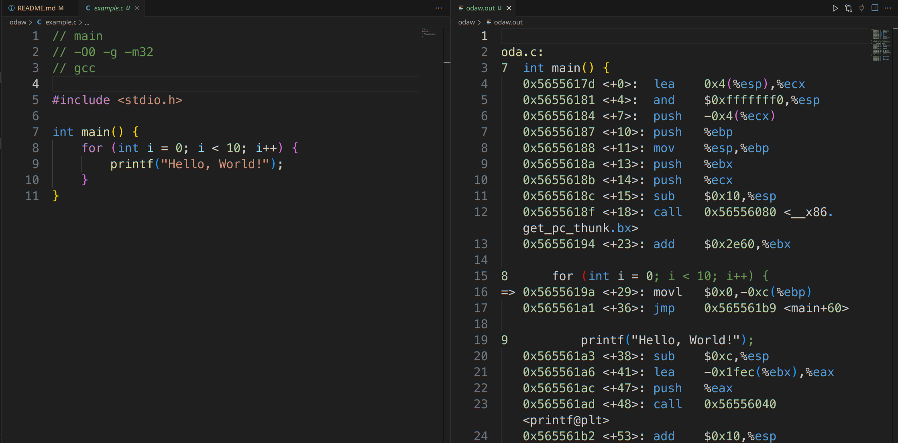

# odaw

A small tool showing the source code's gdb disassembly information on editors

## Requisites

* python
* pyinotify
* gdb
* compliers such as gcc, clang, etc.

## Usage

```shell
python3 odaw.py example.c
```

The source file should include compiler, compile options, and function needed to be disassembled.

Example(example.c):

```c
// main
// -O0 -g -m32
// gcc

#include <stdio.h>

int main() {
    for (int i = 0; i < 10; i++) {
        printf("Hello, World!");
    }
}
```

The result will be saved to odaw.out, then editors such as Visual Studio Code can show both the source file and the disassembly result. As long as the script is being run, it will update the results when the source file is modified.


